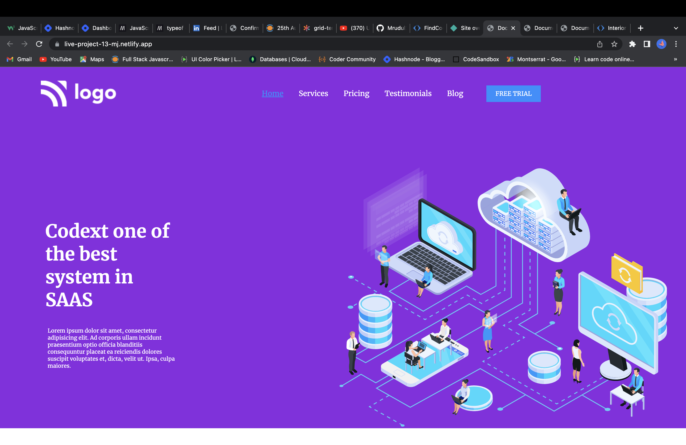
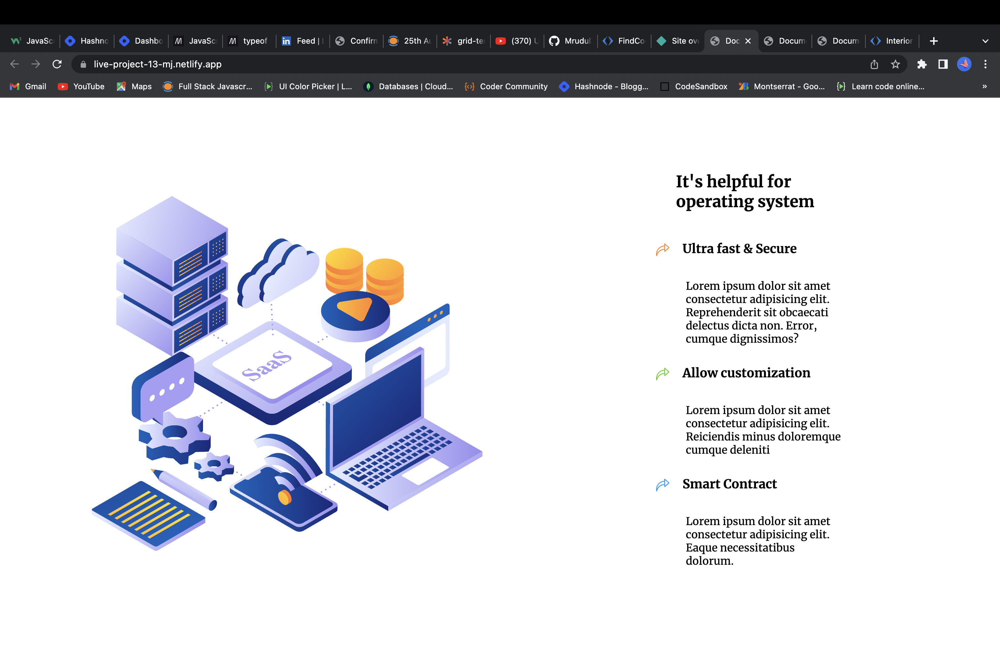
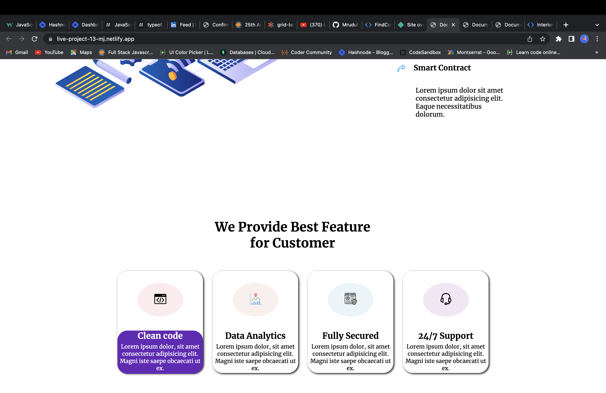

# Hello, I'm Mrudul Janbandhu
- - -
It's a Frontend Web Development Project using HTML and CSS.
- - -

# Webpage

- - -

- While developing this webpage, I became more familiar with HTML, CSS Selectors , different properties of CSS,Position property in CSS and flex box and used Media-query for responsiveness.

- It took around 2 hours to finish this project.